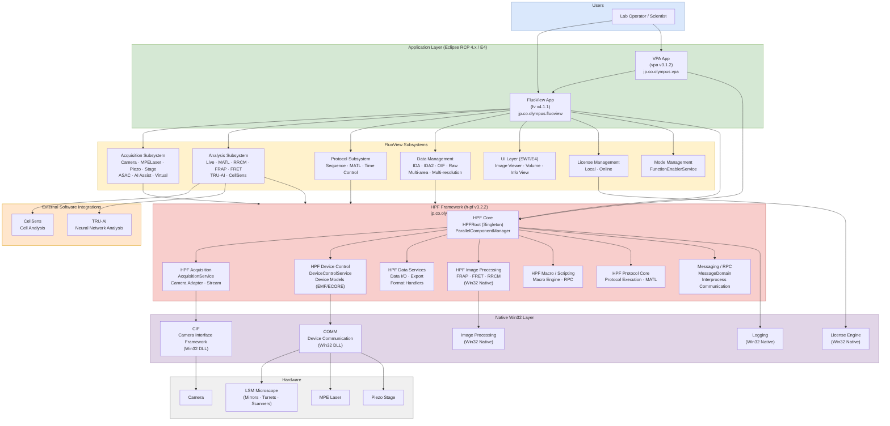

# Architecture Diagram — FluoView / HPF / VPA Platform

```mermaid
graph TB
    subgraph Users["Users"]
        U1["Lab Operator / Scientist"]
    end

    subgraph AppLayer["Application Layer (Eclipse RCP 4.x / E4)"]
        FV["FluoView App\n(fv v4.1.1)\njp.co.olympus.fluoview"]
        VPA["VPA App\n(vpa v3.1.2)\njp.co.olympus.vpa"]
    end

    subgraph FVModules["FluoView Subsystems"]
        ACQ["Acquisition Subsystem\nCamera · MPELaser · Piezo · Stage\nASAC · AI Assist · Virtual"]
        ANA["Analysis Subsystem\nLive · MATL · RRCM · FRAP · FRET\nTRU-AI · CellSens"]
        PROTO["Protocol Subsystem\nSequence · MATL · Time Control"]
        DATA["Data Management\nIDA · IDA2 · OIF · Raw\nMulti-area · Multi-resolution"]
        UI["UI Layer (SWT/E4)\nImage Viewer · Volume · Info View"]
        LIC["License Management\nLocal · Online"]
        MODE["Mode Management\nFunctionEnablerService"]
    end

    subgraph HPF["HPF Framework (h-pf v3.2.2)\njp.co.olympus.hpf"]
        HPFC["HPF Core\nHPFRoot (Singleton)\nParallelComponentManager"]
        HPFACQ["HPF Acquisition\nAcquisitionService\nCamera Adapter · Stream"]
        HPFDEV["HPF Device Control\nDeviceControlService\nDevice Models (EMF/ECORE)"]
        HPFDATA["HPF Data Services\nData I/O · Export\nFormat Handlers"]
        HPFIMG["HPF Image Processing\nFRAP · FRET · RRCM\n(Win32 Native)"]
        HPFMACRO["HPF Macro / Scripting\nMacro Engine · RPC"]
        HPFPROTO["HPF Protocol Core\nProtocol Execution · MATL"]
        MSGRPC["Messaging / RPC\nMessageDomain\nInterprocess Communication"]
    end

    subgraph NativeLayer["Native Win32 Layer"]
        CIF["CIF\nCamera Interface Framework\n(Win32 DLL)"]
        COMM["COMM\nDevice Communication\n(Win32 DLL)"]
        IMGN["Image Processing\n(Win32 Native)"]
        LOGN["Logging\n(Win32 Native)"]
        LICN["License Engine\n(Win32 Native)"]
    end

    subgraph HW["Hardware"]
        MICRO["LSM Microscope\n(Mirrors · Turrets · Scanners)"]
        LASER["MPE Laser"]
        PIEZO["Piezo Stage"]
        CAM["Camera"]
    end

    subgraph ExtSW["External Software Integrations"]
        CS["CellSens\nCell Analysis"]
        TRUAI["TRU-AI\nNeural Network Analysis"]
    end

    U1 --> FV
    U1 --> VPA
    FV --> ACQ & ANA & PROTO & DATA & UI & LIC & MODE
    VPA --> FV
    ACQ & ANA & PROTO & DATA --> HPF
    FV --> HPFC
    VPA --> HPFC
    HPFC --> HPFACQ & HPFDEV & HPFDATA & HPFIMG & HPFMACRO & HPFPROTO & MSGRPC
    HPFDEV --> COMM --> MICRO & LASER & PIEZO
    HPFACQ --> CIF --> CAM
    HPFIMG --> IMGN
    HPFC --> LOGN
    LIC --> LICN
    ANA --> CS & TRUAI

    style Users fill:#dae8fc,stroke:#6c8ebf
    style AppLayer fill:#d5e8d4,stroke:#82b366
    style FVModules fill:#fff2cc,stroke:#d6b656
    style HPF fill:#f8cecc,stroke:#b85450
    style NativeLayer fill:#e1d5e7,stroke:#9673a6
    style HW fill:#f0f0f0,stroke:#999
    style ExtSW fill:#ffe6cc,stroke:#d79b00
```
