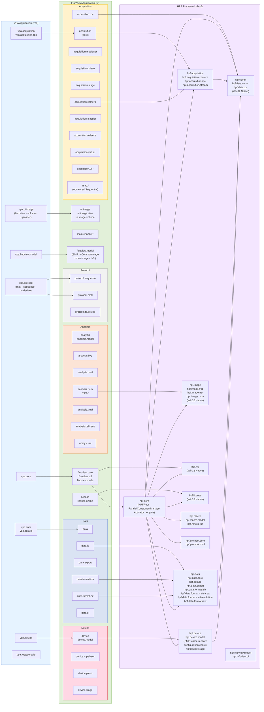

# Component Diagram — OSGi Bundle Dependencies

```mermaid
graph LR
    subgraph VPA_APP["VPA Application (vpa)"]
        VPA_CORE["vpa.core"]
        VPA_ACQ["vpa.acquisition\nvpa.acquisition.rpc"]
        VPA_DATA["vpa.data\nvpa.data.io"]
        VPA_DEV["vpa.device"]
        VPA_UI["vpa.ui.image\n(bird view · volume · uploader)"]
        VPA_PROTO["vpa.protocol\n(matl · sequence · tc.device)"]
        VPA_MODEL["vpa.fluoview.model"]
        VPA_TEST["vpa.testscenario"]
    end

    subgraph FV_APP["FluoView Application (fv)"]
        FV_CORE["fluoview.core\nfluoview.util\nfluoview.mode"]

        subgraph FV_ACQ["Acquisition"]
            ACQ_CORE["acquisition\n(core)"]
            ACQ_CAM["acquisition.camera"]
            ACQ_LASER["acquisition.mpelaser"]
            ACQ_PIEZO["acquisition.piezo"]
            ACQ_STAGE["acquisition.stage"]
            ACQ_RPC["acquisition.rpc"]
            ACQ_AI["acquisition.aiassist"]
            ACQ_CS["acquisition.cellsens"]
            ACQ_VIRT["acquisition.virtual"]
            ACQ_UI["acquisition.ui.*"]
            ASAC["asac.*\n(Advanced Sequential)"]
        end

        subgraph FV_ANA["Analysis"]
            ANA_CORE["analysis\nanalysis.model"]
            ANA_LIVE["analysis.live"]
            ANA_MATL["analysis.matl"]
            ANA_RRCM["analysis.rrcm\nrrcm.*"]
            ANA_TRUAI["analysis.truai"]
            ANA_CS["analysis.cellsens"]
            ANA_UI["analysis.ui"]
        end

        subgraph FV_PROTO["Protocol"]
            PROTO_SEQ["protocol.sequence"]
            PROTO_MATL["protocol.matl"]
            PROTO_TC["protocol.tc.device"]
        end

        subgraph FV_DATA["Data"]
            DATA_CORE["data"]
            DATA_IO["data.io"]
            DATA_EXP["data.export"]
            DATA_IDA["data.format.ida"]
            DATA_OIF["data.format.oif"]
            DATA_UI["data.ui"]
        end

        subgraph FV_DEV["Device"]
            DEV_CORE["device\ndevice.model"]
            DEV_MPE["device.mpelaser"]
            DEV_PIEZO["device.piezo"]
            DEV_STAGE["device.stage"]
        end

        FV_UI["ui.image\nui.image.view\nui.image.volume"]
        FV_LIC["license\nlicense.online"]
        FV_MAINT["maintenance.*"]
        FV_MODEL["fluoview.model\n(EMF: fvCommonimage\nfvLsmimage · fvBi)"]
    end

    subgraph HPF["HPF Framework (h-pf)"]
        HPF_CORE["hpf.core\n(HPFRoot · ParallelComponentManager\nActivator · engine)"]
        HPF_ACQ["hpf.acquisition\nhpf.acquisition.camera\nhpf.acquisition.rpc\nhpf.acquisition.stream"]
        HPF_DEV["hpf.device\nhpf.device.model\n(EMF: camera.ecore\nconfiguration.ecore)\nhpf.device.stage"]
        HPF_DATA["hpf.data\nhpf.data.core\nhpf.data.io\nhpf.data.export\nhpf.data.format.ida\nhpf.data.format.multiarea\nhpf.data.format.multiresolution\nhpf.data.format.raw"]
        HPF_COMM["hpf.comm\nhpf.data.comm\nhpf.data.rpc\n(Win32 Native)"]
        HPF_IMG["hpf.image\nhpf.image.frap\nhpf.image.fret\nhpf.image.rrcm\n(Win32 Native)"]
        HPF_LOG["hpf.log\n(Win32 Native)"]
        HPF_LIC["hpf.license\n(Win32 Native)"]
        HPF_MACRO["hpf.macro\nhpf.macro.model\nhpf.macro.rpc"]
        HPF_PROTO["hpf.protocol.core\nhpf.protocol.matl"]
        HPF_INFO["hpf.infoview.model\nhpf.infoview.ui"]
    end

    %% VPA → FluoView
    VPA_CORE --> FV_CORE
    VPA_ACQ --> ACQ_CORE
    VPA_DATA --> DATA_CORE
    VPA_DEV --> DEV_CORE
    VPA_UI --> FV_UI
    VPA_PROTO --> PROTO_SEQ & PROTO_MATL
    VPA_MODEL --> FV_MODEL

    %% FluoView → HPF
    FV_CORE --> HPF_CORE
    ACQ_CORE --> HPF_ACQ
    ACQ_CAM --> HPF_ACQ
    ACQ_RPC --> HPF_COMM
    DEV_CORE --> HPF_DEV
    DATA_IO --> HPF_DATA
    DATA_IDA & DATA_OIF --> HPF_DATA
    ANA_RRCM --> HPF_IMG
    FV_LIC --> HPF_LIC
    FV_CORE --> HPF_LOG

    %% HPF internal
    HPF_CORE --> HPF_ACQ & HPF_DEV & HPF_DATA & HPF_IMG & HPF_COMM & HPF_LOG & HPF_LIC & HPF_MACRO & HPF_PROTO
    HPF_ACQ --> HPF_COMM
    HPF_DATA --> HPF_COMM
    HPF_DEV --> HPF_COMM

    style VPA_APP fill:#e6f3ff,stroke:#4472c4
    style FV_APP fill:#e2f0d9,stroke:#70ad47
    style FV_ACQ fill:#fff2cc,stroke:#ffc000
    style FV_ANA fill:#fce4d6,stroke:#ed7d31
    style FV_PROTO fill:#f2f2f2,stroke:#999
    style FV_DATA fill:#dae3f3,stroke:#4472c4
    style FV_DEV fill:#ffd7e4,stroke:#c00000
    style HPF fill:#f4e6ff,stroke:#7030a0
```
