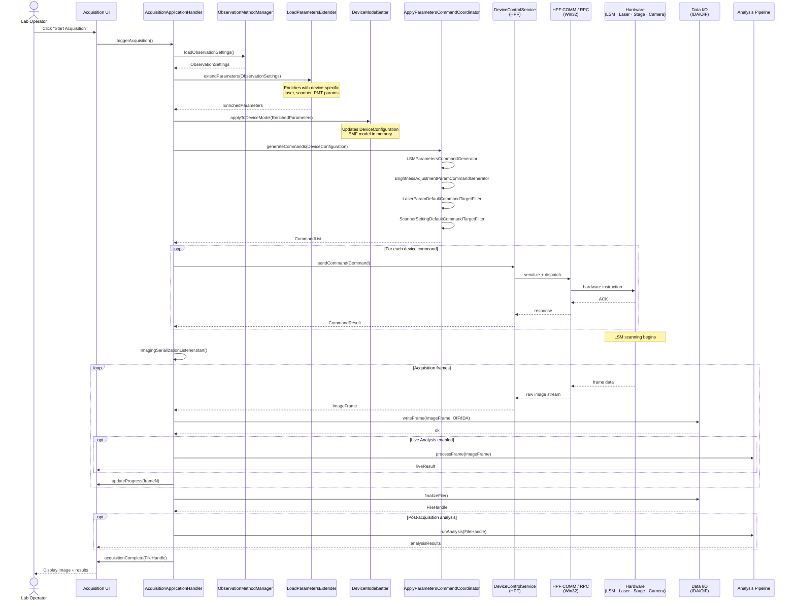
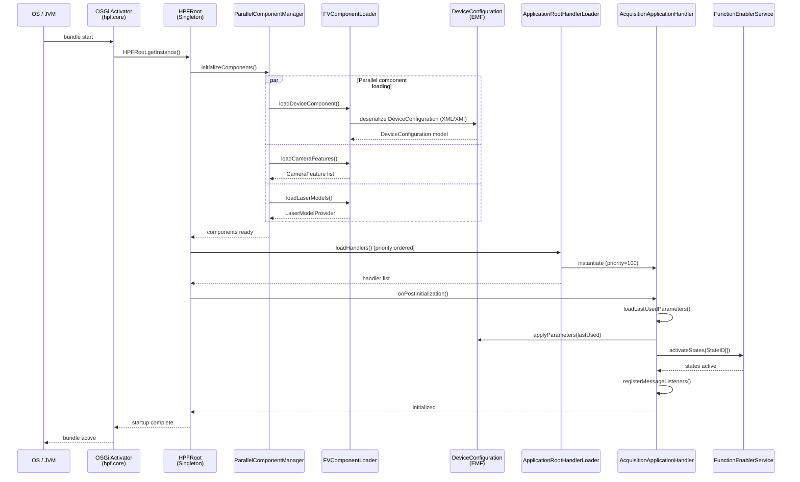
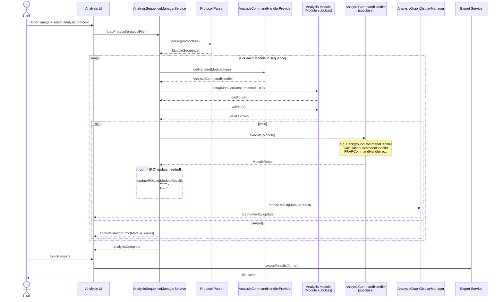

# Sequence Diagrams — Key Business Flows

---

## Flow 1: Image Acquisition

```mermaid
sequenceDiagram
    actor User as Lab Operator
    participant UI as Acquisition UI
    participant AAH as AcquisitionApplicationHandler
    participant OMM as ObservationMethodManager
    participant LPE as LoadParametersExtender
    participant DMS as DeviceModelSetter
    participant APCG as ApplyParametersCommandCoordinator
    participant DCS as DeviceControlService<br/>(HPF)
    participant RPC as HPF COMM / RPC<br/>(Win32)
    participant HW as Hardware<br/>(LSM · Laser · Stage · Camera)
    participant DIO as Data I/O<br/>(IDA/OIF)
    participant ANA as Analysis Pipeline

    User->>UI: Click "Start Acquisition"
    UI->>AAH: triggerAcquisition()

    AAH->>OMM: loadObservationSettings()
    OMM-->>AAH: ObservationSettings

    AAH->>LPE: extendParameters(ObservationSettings)
    Note over LPE: Enriches with device-specific<br/>laser, scanner, PMT params
    LPE-->>AAH: EnrichedParameters

    AAH->>DMS: applyToDeviceModel(EnrichedParameters)
    Note over DMS: Updates DeviceConfiguration<br/>EMF model in memory

    AAH->>APCG: generateCommands(DeviceConfiguration)
    APCG->>APCG: LSMParametersCommandGenerator
    APCG->>APCG: BrightnessAdjustmentParamCommandGenerator
    APCG->>APCG: LaserParamDefaultCommandTargetFilter
    APCG->>APCG: ScannerSettingDefaultCommandTargetFilter
    APCG-->>AAH: CommandList

    loop For each device command
        AAH->>DCS: sendCommand(Command)
        DCS->>RPC: serialize + dispatch
        RPC->>HW: hardware instruction
        HW-->>RPC: ACK
        RPC-->>DCS: response
        DCS-->>AAH: CommandResult
    end

    Note over HW: LSM scanning begins

    AAH->>AAH: ImagingSerializationListener.start()

    loop Acquisition frames
        HW-->>RPC: frame data
        RPC-->>DCS: raw image stream
        DCS-->>AAH: ImageFrame
        AAH->>DIO: writeFrame(ImageFrame, OIF/IDA)
        DIO-->>AAH: ok

        opt Live Analysis enabled
            AAH->>ANA: processFrame(ImageFrame)
            ANA-->>UI: liveResult
        end

        AAH->>UI: updateProgress(frameN)
    end

    AAH->>DIO: finalizeFile()
    DIO-->>AAH: FileHandle

    opt Post-acquisition analysis
        AAH->>ANA: runAnalysis(FileHandle)
        ANA-->>UI: analysisResults
    end

    AAH->>UI: acquisitionComplete(FileHandle)
    UI-->>User: Display image + results
```

---

## Flow 2: Application Startup & Device Initialization

```mermaid
sequenceDiagram
    participant OS as OS / JVM
    participant ACT as OSGi Activator<br/>(hpf.core)
    participant ROOT as HPFRoot<br/>(Singleton)
    participant PCM as ParallelComponentManager
    participant FCL as FVComponentLoader
    participant DC as DeviceConfiguration<br/>(EMF)
    participant ARHL as ApplicationRootHandlerLoader
    participant AAH as AcquisitionApplicationHandler
    participant FES as FunctionEnablerService

    OS->>ACT: bundle start
    ACT->>ROOT: HPFRoot.getInstance()
    ROOT->>PCM: initializeComponents()

    par Parallel component loading
        PCM->>FCL: loadDeviceComponent()
        FCL->>DC: deserialize DeviceConfiguration (XML/XMI)
        DC-->>FCL: DeviceConfiguration model
    and
        PCM->>FCL: loadCameraFeatures()
        FCL-->>PCM: CameraFeature list
    and
        PCM->>FCL: loadLaserModels()
        FCL-->>PCM: LaserModelProvider
    end

    PCM-->>ROOT: components ready

    ROOT->>ARHL: loadHandlers() [priority ordered]
    ARHL->>AAH: instantiate (priority=100)
    ARHL-->>ROOT: handler list

    ROOT->>AAH: onPostInitialization()
    AAH->>AAH: loadLastUsedParameters()
    AAH->>DC: applyParameters(lastUsed)
    AAH->>FES: activateStates(StateID[])
    FES-->>AAH: states active

    AAH->>AAH: registerMessageListeners()
    AAH-->>ROOT: initialized

    ROOT-->>ACT: startup complete
    ACT-->>OS: bundle active
```

---

## Flow 3: Analysis Pipeline Execution

```mermaid
sequenceDiagram
    actor User
    participant UI as Analysis UI
    participant ASMS as AnalysisSequenceManagerService
    participant PP as Protocol Parser
    participant ACHP as AnalysisCommandHandlerProvider
    participant MOD as Analysis Module<br/>(Module subclass)
    participant ACH as AnalysisCommandHandler<br/>(subclass)
    participant AGDM as AnalysisGraphDisplayManager
    participant EXP as Export Service

    User->>UI: Open image + select analysis protocol
    UI->>ASMS: loadProtocol(protocolFile)
    ASMS->>PP: parse(protocolFile)
    PP-->>ASMS: ModuleSequence[]

    loop For each Module in sequence
        ASMS->>ACHP: getHandler(Module.type)
        ACHP-->>ASMS: AnalysisCommandHandler

        ASMS->>MOD: setupModule(frame, channel, ROI)
        MOD-->>ASMS: configured

        ASMS->>MOD: validate()
        MOD-->>ASMS: valid / errors

        alt valid
            ASMS->>ACH: execute(Module)
            Note over ACH: e.g. BackgroundCommandHandler<br/>CalculationCommandHandler<br/>FRAPCommandHandler etc.
            ACH-->>ASMS: ModuleResult

            opt ROI update needed
                ASMS->>ASMS: updateROIList(ModuleResult)
            end

            ASMS->>AGDM: renderResult(ModuleResult)
            AGDM-->>UI: graph/overlay update
        else invalid
            ASMS-->>UI: showValidationError(Module, errors)
        end
    end

    ASMS-->>UI: analysisComplete
    User->>UI: Export results
    UI->>EXP: exportResults(format)
    EXP-->>User: file saved
```
