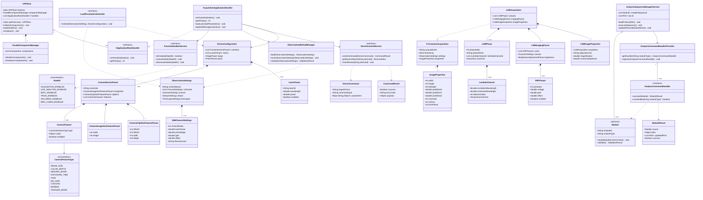

# Class Diagram — Core Domain Models

```mermaid
classDiagram

    %% ─── APPLICATION BOOTSTRAP ───────────────────────────────
    class HPFRoot {
        -static HPFRoot instance
        -ParallelComponentManager componentManager
        -List~IApplicationRootHandler~ handlers
        +static getInstance() HPFRoot
        +initializeComponents() void
        +loadHandlers() void
        +shutdown() void
    }

    class ParallelComponentManager {
        -List~IComponent~ components
        +initializeComponents() void
        +shutdownComponents() void
    }

    class IApplicationRootHandler {
        <<interface>>
        +onPostInitialization() void
        +getPriority() int
    }

    class AcquisitionApplicationHandler {
        +onPostInitialization() void
        +getPriority() int
        -loadLastUsedParameters() void
        -registerMessageListeners() void
    }

    HPFRoot "1" *-- "1" ParallelComponentManager
    HPFRoot "1" o-- "many" IApplicationRootHandler
    AcquisitionApplicationHandler ..|> IApplicationRootHandler

    %% ─── DEVICE CONFIGURATION (EMF) ─────────────────────────
    class DeviceConfiguration {
        +List~CameraDeviceParam~ cameras
        +List~LaserParam~ lasers
        +StageParam stage
        +PiezoParam piezo
    }

    class CameraDeviceParam {
        +String cameraId
        +CameraImageSizeFeatureParam imageSize
        +CameraClipSizeFeatureParam clipSize
        +List~CameraFeature~ features
    }

    class CameraFeature {
        +CameraFeatureType type
        +Object value
        +boolean enabled
    }

    class CameraFeatureType {
        <<enumeration>>
        IMAGE_SIZE
        COLOR_DEPTH
        IMAGING_MODE
        EXPOSURE_TIME
        GAIN
        EM_GAIN
        COOLING
        BINNING
        TRIGGER_MODE
    }

    class CameraImageSizeFeatureParam {
        +int width
        +int height
    }

    class CameraClipSizeFeatureParam {
        +int offsetX
        +int offsetY
        +int width
        +int height
    }

    class LaserParam {
        +String laserId
        +double wavelength
        +double power
        +boolean enabled
    }

    DeviceConfiguration "1" *-- "many" CameraDeviceParam
    DeviceConfiguration "1" *-- "many" LaserParam
    CameraDeviceParam "1" *-- "many" CameraFeature
    CameraDeviceParam "1" *-- "1" CameraImageSizeFeatureParam
    CameraDeviceParam "1" *-- "1" CameraClipSizeFeatureParam
    CameraFeature --> CameraFeatureType

    %% ─── OBSERVATION / ACQUISITION SETTINGS ─────────────────
    class ObservationSettings {
        +String methodName
        +List~ChannelSettings~ channels
        +ScannerSettings scanner
        +ZStackSettings zStack
        +TimeLapseSettings timeLapse
    }

    class ISMChannelSettings {
        +int channelIndex
        +double laserPower
        +double pmtVoltage
        +double gain
        +double offset
        +String fluorochrome
    }

    class ObservationMethodManager {
        +loadObservationSettings() ObservationSettings
        +saveObservationSettings(ObservationSettings) void
        +validate(ObservationSettings) ValidationResult
    }

    class LoadParametersExtender {
        <<interface>>
        +extend(ObservationSettings, DeviceConfiguration) void
    }

    ObservationSettings "1" *-- "many" ISMChannelSettings
    ObservationMethodManager ..> ObservationSettings
    LoadParametersExtender ..> ObservationSettings
    LoadParametersExtender ..> DeviceConfiguration

    %% ─── IMAGE / LSM MODELS (EMF) ────────────────────────────
    class FvCommonAcquisition {
        +String acquisitionId
        +Date timestamp
        +ObservationSettings settings
        +ImageProperties properties
    }

    class ImageProperties {
        +int width
        +int height
        +int bitDepth
        +double pixelSizeX
        +double pixelSizeY
        +double pixelSizeZ
        +int channels
        +int zSlices
        +int timePoints
    }

    class LSMAcquisition {
        +List~LSMPhase~ phases
        +LSMImagingParam imagingParam
        +LSMImageProperties imageProperties
    }

    class LSMPhase {
        +int phaseIndex
        +String phaseName
        +List~LambdaChannel~ lambdaChannels
        +ScanArea scanArea
    }

    class LambdaChannel {
        +double excitationWavelength
        +double emissionWavelength
        +int detectorIndex
        +String fluorochrome
    }

    class LSMImageProperties {
        +LSMAcquisition acquisition
        +String objectiveLens
        +double magnification
        +double numericalAperture
    }

    class LSMImagingParam {
        +List~PMTParam~ pmts
        +ScannerSettings scanner
        +BrightnessAdjustmentParam brightness
    }

    class PMTParam {
        +int pmtIndex
        +double voltage
        +double gain
        +double offset
        +boolean enabled
    }

    FvCommonAcquisition "1" *-- "1" ImageProperties
    LSMAcquisition ..|> FvCommonAcquisition
    LSMAcquisition "1" *-- "many" LSMPhase
    LSMAcquisition "1" *-- "1" LSMImagingParam
    LSMPhase "1" *-- "many" LambdaChannel
    LSMAcquisition "1" *-- "1" LSMImageProperties
    LSMImagingParam "1" *-- "many" PMTParam

    %% ─── DEVICE CONTROL SERVICE ──────────────────────────────
    class DeviceControlService {
        <<interface>>
        +sendCommand(DeviceCommand) CommandResult
        +getDeviceStatus(String deviceId) DeviceStatus
        +resetDevice(String deviceId) void
    }

    class DeviceCommand {
        +String targetDevice
        +String commandType
        +Map~String,Object~ parameters
    }

    class CommandResult {
        +boolean success
        +String errorCode
        +Object payload
    }

    DeviceControlService ..> DeviceCommand
    DeviceControlService ..> CommandResult

    %% ─── ANALYSIS FRAMEWORK ──────────────────────────────────
    class Module {
        <<abstract>>
        +String moduleId
        +String moduleType
        +setupModule(FrameContext) void
        +validate() ValidationResult
    }

    class AnalysisCommandHandler {
        <<interface>>
        +execute(Module) ModuleResult
        +canHandle(String moduleType) boolean
    }

    class AnalysisSequenceManagerService {
        -List~Module~ moduleSequence
        -List~ROI~ roiList
        +loadProtocol(File) void
        +executeSequence() void
        +updateROIList(ModuleResult) void
    }

    class AnalysisCommandHandlerProvider {
        +getHandler(String moduleType) AnalysisCommandHandler
        +register(AnalysisCommandHandler) void
    }

    class ModuleResult {
        +Module source
        +Object data
        +List~ROI~ updatedROIs
        +boolean success
    }

    AnalysisSequenceManagerService "1" o-- "many" Module
    AnalysisSequenceManagerService --> AnalysisCommandHandlerProvider
    AnalysisCommandHandlerProvider "1" o-- "many" AnalysisCommandHandler
    AnalysisCommandHandler ..> Module
    AnalysisCommandHandler ..> ModuleResult

    %% ─── LICENSING & FEATURE GATING ──────────────────────────
    class FunctionEnablerService {
        <<interface>>
        +isEnabled(StateID) boolean
        +activateState(StateID) void
        +deactivateState(StateID) void
    }

    class StateID {
        <<enumeration>>
        ACQUISITION_ENABLED
        LIVE_ANALYSIS_ENABLED
        MATL_ENABLED
        TRUAI_ENABLED
        CELLSENS_ENABLED
        MPE_LASER_ENABLED
    }

    FunctionEnablerService ..> StateID
    AcquisitionApplicationHandler --> FunctionEnablerService
    AcquisitionApplicationHandler --> ObservationMethodManager
    AcquisitionApplicationHandler --> DeviceControlService
    AcquisitionApplicationHandler --> DeviceConfiguration
```
