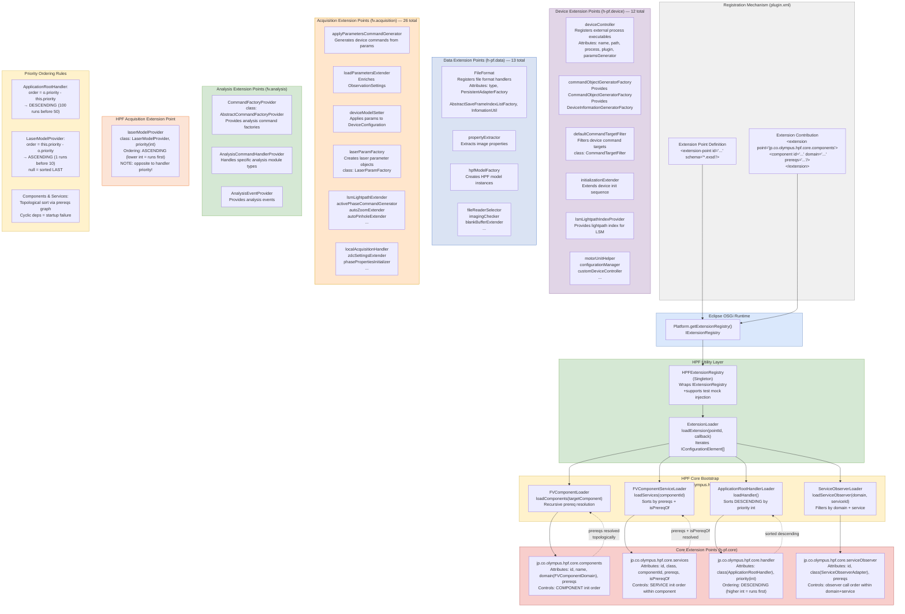
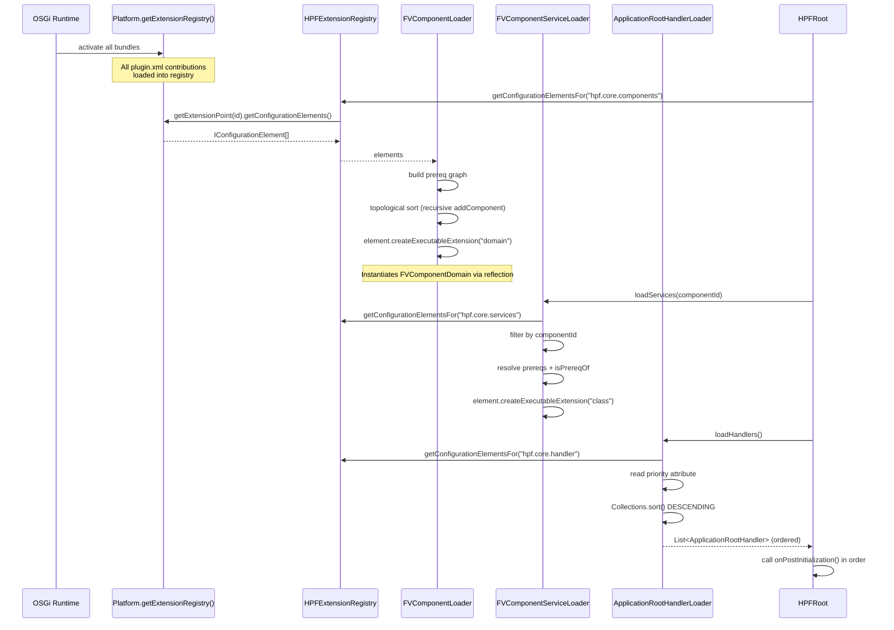

# Extension Point & Plugin Mechanism Diagram

## How the OSGi Extension System Works

```mermaid
flowchart TD
    subgraph EclipseRuntime["Eclipse OSGi Runtime"]
        ER["Platform.getExtensionRegistry()\nIExtensionRegistry"]
    end

    subgraph HPFUtil["HPF Utility Layer\njp.co.olympus.hpf.util"]
        HPFREG["HPFExtensionRegistry\n(Singleton)\nWraps IExtensionRegistry\n+supports test mock injection"]
        EXTLDR["ExtensionLoader\nloadExtension(pointId, callback)\nIterates IConfigurationElement[]"]
    end

    subgraph HPFCore["HPF Core Bootstrap\njp.co.olympus.hpf.core"]
        COMPLDR["FVComponentLoader\nloadComponents(targetComponent)\nRecursive prereq resolution"]
        SVCLDR["FVComponentServiceLoader\nloadServices(componentId)\nSorts by prereqs + isPrereqOf"]
        HDLLDR["ApplicationRootHandlerLoader\nloadHandler()\nSorts DESCENDING by priority int"]
        OBSLDR["ServiceObserverLoader\nloadServiceObserver(domain, serviceId)\nFilters by domain + service"]
    end

    subgraph RegMechanism["Registration Mechanism (plugin.xml)"]
        direction TB
        EP1["Extension Point Definition\n&lt;extension-point id='...' schema='*.exsd'/&gt;"]
        EP2["Extension Contribution\n&lt;extension point='jp.co.olympus.hpf.core.components'&gt;\n  &lt;component id='...' domain='...' prereqs='...'/&gt;\n&lt;/extension&gt;"]
    end

    subgraph CoreExtPoints["Core Extension Points (h-pf.core)"]
        CEP1["jp.co.olympus.hpf.core.components\nAttributes: id, name, domain(FVComponentDomain), prereqs\nControls: COMPONENT init order"]
        CEP2["jp.co.olympus.hpf.core.services\nAttributes: id, class, componentId, prereqs, isPrereqOf\nControls: SERVICE init order within component"]
        CEP3["jp.co.olympus.hpf.core.handler\nAttributes: class(ApplicationRootHandler), priority(int)\nOrdering: DESCENDING (higher int = runs first)"]
        CEP4["jp.co.olympus.hpf.core.serviceObserver\nAttributes: id, class(ServiceObserverAdapter), prereqs\nControls: observer call order within domain+service"]
    end

    subgraph DeviceExtPoints["Device Extension Points (h-pf.device) — 12 total"]
        DEP1["deviceController\nRegisters external process executables\nAttributes: name, path, process, plugin, paramsGenerator"]
        DEP2["commandObjectGeneratorFactory\nProvides CommandObjectGeneratorFactory\nProvides DeviceInformationGeneratorFactory"]
        DEP3["defaultCommandTargetFilter\nFilters device command targets\nclass: CommandTargetFilter"]
        DEP4["initializationExtender\nExtends device init sequence"]
        DEP5["lsmLightpathIndexProvider\nProvides lightpath index for LSM"]
        DEP6["motorUnitHelper\nconfigurationManager\ncustomDeviceController\n..."]
    end

    subgraph DataExtPoints["Data Extension Points (h-pf.data) — 13 total"]
        DAEP1["FileFormat\nRegisters file format handlers\nAttributes: type, PersistentAdapterFactory\n         AbstractSaveFrameIndexListFactory, InfomationUtil"]
        DAEP2["propertyExtractor\nExtracts image properties"]
        DAEP3["hpfModelFactory\nCreates HPF model instances"]
        DAEP4["fileReaderSelector\nimagingChecker\nblankBufferExtender\n..."]
    end

    subgraph AcqExtPoints["Acquisition Extension Points (fv.acquisition) — 26 total"]
        AEP1["applyParametersCommandGenerator\nGenerates device commands from params"]
        AEP2["loadParametersExtender\nEnriches ObservationSettings"]
        AEP3["deviceModelSetter\nApplies params to DeviceConfiguration"]
        AEP4["laserParamFactory\nCreates laser parameter objects\nclass: LaserParamFactory"]
        AEP5["lsmLightpathExtender\nactivePhaseCommandGenerator\nautoZoomExtender\nautoPinholeExtender\n..."]
        AEP6["localAcquisitionHandler\nzdcSettingsExtender\nphasePropertiesInitializer\n..."]
    end

    subgraph AnaExtPoints["Analysis Extension Points (fv.analysis)"]
        ANEP1["CommandFactoryProvider\nclass: AbstractCommandFactoryProvider\nProvides analysis command factories"]
        ANEP2["AnalysisCommandHandlerProvider\nHandles specific analysis module types"]
        ANEP3["AnalysisEventProvider\nProvides analysis events"]
    end

    subgraph HPFAcqExtPoints["HPF Acquisition Extension Point"]
        HAEP["laserModelProvider\nclass: LaserModelProvider, priority(int)\nOrdering: ASCENDING (lower int = runs first)\nNOTE: opposite to handler priority!"]
    end

    subgraph PriorityNote["Priority Ordering Rules"]
        PN1["ApplicationRootHandler:\norder = o.priority - this.priority\n→ DESCENDING (100 runs before 50)"]
        PN2["LaserModelProvider:\norder = this.priority - o.priority\n→ ASCENDING (1 runs before 10)\nnull = sorted LAST"]
        PN3["Components & Services:\nTopological sort via prereqs graph\nCyclic deps = startup failure"]
    end

    ER --> HPFREG
    HPFREG --> EXTLDR
    EXTLDR --> COMPLDR & SVCLDR & HDLLDR & OBSLDR

    EP1 & EP2 --> ER

    COMPLDR --> CEP1
    SVCLDR --> CEP2
    HDLLDR --> CEP3
    OBSLDR --> CEP4

    CEP1 -.->|"prereqs resolved\ntopologically"| COMPLDR
    CEP2 -.->|"prereqs + isPrereqOf\nresolved"| SVCLDR
    CEP3 -.->|"sorted descending"| HDLLDR

    style EclipseRuntime fill:#dae8fc,stroke:#6c8ebf
    style HPFUtil fill:#d5e8d4,stroke:#82b366
    style HPFCore fill:#fff2cc,stroke:#d6b656
    style RegMechanism fill:#f0f0f0,stroke:#999
    style CoreExtPoints fill:#f8cecc,stroke:#b85450
    style DeviceExtPoints fill:#e1d5e7,stroke:#9673a6
    style DataExtPoints fill:#dae3f3,stroke:#4472c4
    style AcqExtPoints fill:#ffe6cc,stroke:#d79b00
    style AnaExtPoints fill:#d5e8d4,stroke:#82b366
    style HPFAcqExtPoints fill:#fce4d6,stroke:#ed7d31
    style PriorityNote fill:#fff2cc,stroke:#d6b656
```

## Extension Point Registration Flow (Startup)

```mermaid
sequenceDiagram
    participant OSGi as OSGi Runtime
    participant EPR as Platform.getExtensionRegistry()
    participant HPFR as HPFExtensionRegistry
    participant CL as FVComponentLoader
    participant SL as FVComponentServiceLoader
    participant HL as ApplicationRootHandlerLoader
    participant Root as HPFRoot

    OSGi->>EPR: activate all bundles
    Note over EPR: All plugin.xml contributions<br/>loaded into registry

    Root->>HPFR: getConfigurationElementsFor("hpf.core.components")
    HPFR->>EPR: getExtensionPoint(id).getConfigurationElements()
    EPR-->>HPFR: IConfigurationElement[]
    HPFR-->>CL: elements

    CL->>CL: build prereq graph
    CL->>CL: topological sort (recursive addComponent)
    CL->>CL: element.createExecutableExtension("domain")
    Note over CL: Instantiates FVComponentDomain via reflection

    Root->>SL: loadServices(componentId)
    SL->>HPFR: getConfigurationElementsFor("hpf.core.services")
    SL->>SL: filter by componentId
    SL->>SL: resolve prereqs + isPrereqOf
    SL->>SL: element.createExecutableExtension("class")

    Root->>HL: loadHandlers()
    HL->>HPFR: getConfigurationElementsFor("hpf.core.handler")
    HL->>HL: read priority attribute
    HL->>HL: Collections.sort() DESCENDING
    HL-->>Root: List<ApplicationRootHandler> (ordered)

    Root->>Root: call onPostInitialization() in order
```
