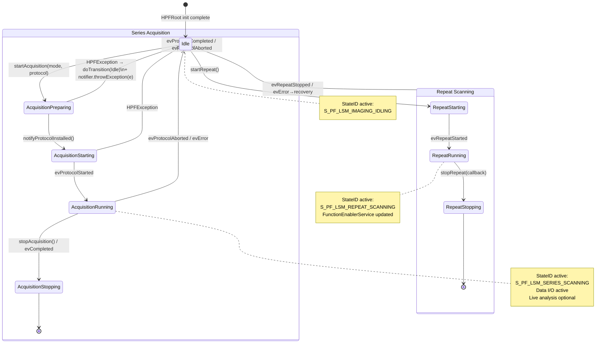
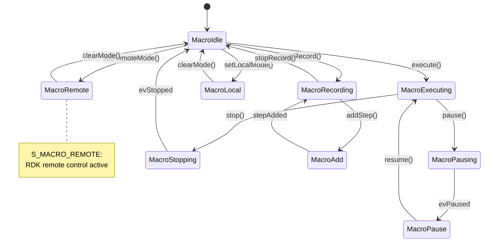
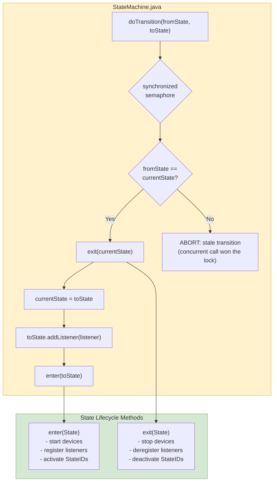

# State Machine Diagrams

## Acquisition State Machine (StateMachine.java — hpf.acquisition)

## Macro State Machine (hpf.macro)

## Application-Level StateID Reference

```mermaid
graph LR
    subgraph LSMStates["LSM Imaging States (VPA StateID)"]
        direction TB
        S1["S_PF_LSM_IMAGING_IDLING\nIdle — ready for commands"]
        S2["S_PF_LSM_REPEAT_STARTING\nInitiating live view"]
        S3["S_PF_LSM_REPEAT_SCANNING\nLive/repeat scan running"]
        S4["S_PF_LSM_REPEAT_STOPPING\nStopping live view"]
        S5["S_PF_LSM_SERIES_STARTING\nSeries acquisition starting"]
        S6["S_PF_LSM_SERIES_SCANNING\nSeries acquisition running"]
        S7["S_PF_LSM_SERIES_STOPPING\nSeries acquisition stopping"]
        S8["S_PF_LSM_RESTING\nDevice cool-down / rest period"]
        S9["S_PF_LSM_REST_ENDING\nExiting rest period"]
        S10["S_PF_LSM_SERIES_WAITING_APPEND\nWaiting for user append command"]
        S11["S_PF_LSM_SERIES_WAITING_TRIGGER_START\nWaiting for external trigger signal"]
    end

    subgraph AppStates["Application Lifecycle States"]
        A1["S_VPA_APPLICATION_STARTING\nApp bootstrap in progress"]
        A2["S_VPA_APPLICATION_STARTING_END\nBootstrap complete, UI ready"]
    end

    subgraph MacroStates["Macro States (HPF Macro)"]
        M1["S_MACRO_IDLING"]
        M2["S_MACRO_EXECUTING"]
        M3["S_MACRO_PAUSE / S_MACRO_PAUSING"]
        M4["S_MACRO_RECORDING"]
        M5["S_MACRO_STOPPING"]
        M6["S_MACRO_ADD"]
        M7["S_MACRO_LOCAL / S_MACRO_REMOTE"]
    end

    subgraph FES["FunctionEnablerService\n(hpf.core)"]
        FES1["activate(stateId)\nactivateAll(List)\ndeactivate(stateId)\nisEnable(functionId)\nhasPossibilityChange(functionId)\naddFunctionConditionChangedListener()"]
    end

    LSMStates --> FES
    AppStates --> FES
    MacroStates --> FES

    FES --> UI["UI Components\n(buttons, menus, panels)\nenabled/disabled based\non active state"]
```

## State Transition Guard & Thread Safety

