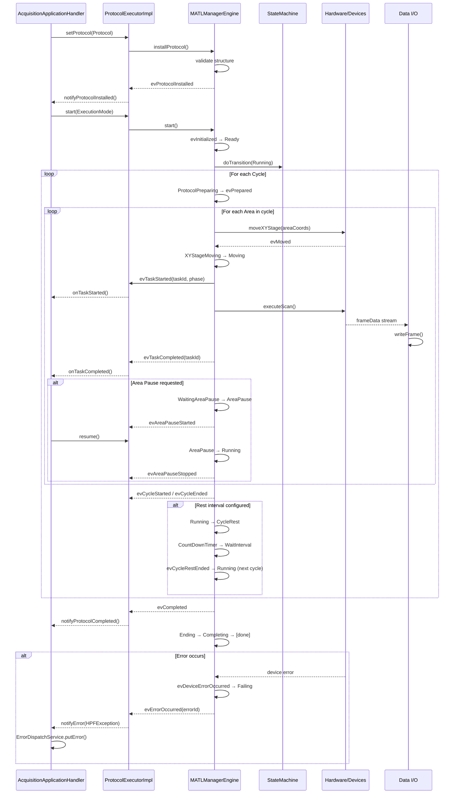
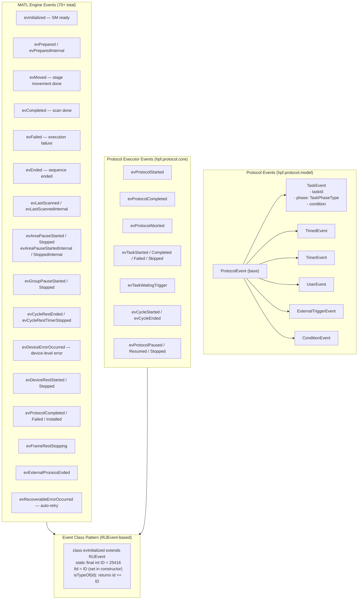

# Protocol Execution Engine Diagrams

## MATL (Multi-Area Time-Lapse) State Machine — MATLManagerEngine.java

```mermaid
stateDiagram-v2
    [*] --> Ready : evInitialized

    Ready --> Running : start()

    state Running {
        [*] --> ProtocolPreparing
        ProtocolPreparing --> ProtocolRunning : evPrepared / evPreparedInternal
        ProtocolRunning --> WaitingDeviceStopped : area scan complete

        state RunningMain {
            [*] --> Scanning

            state Scanning {
                [*] --> Preparing
                Preparing --> XYStageMoving : move to next area
                XYStageMoving --> Moving : evMoved
                Moving --> Preparing : next area
                Moving --> [*] : evLastScanned / evLastScannedInternal
            }
        }

        state RunningGroup {
            WaitingGroupPause --> GroupPause : evGroupPauseStarted
            GroupPause --> Running : evGroupPauseStopped

            state GroupPause {
                GroupPauseStopping
                GroupPauseStarting
            }
        }

        WaitingAreaPause --> AreaPause : evAreaPauseStarted
        AreaPause --> Running : evAreaPauseStopped

        WaitingAreaPauseCauseError --> Failing : evDeviceErrorOccurred
    }

    state CycleRest {
        [*] --> Rest
        Rest --> CountDownTimer : timer start
        CountDownTimer --> WaitInterval : evCycleRestTimerStopped
        WaitInterval --> [*] : evCycleRestEnded
    }

    Running --> CycleRest : cycle complete, rest interval configured
    CycleRest --> Running : next cycle

    Running --> Ending : evCompleted / evEnded
    Running --> Failing : evFailed / evDeviceErrorOccurred

    Failing --> Stopping : error handled
    Ending --> Completing : finalize data
    Completing --> [*] : evExternalProcessEnded

    Stopping --> [*]

    note right of AreaPause
        User-triggered pause
        between areas
    end note

    note right of CycleRest
        Configured rest between
        time-lapse cycles
        (evFrameRestStopping)
    end note

    note right of Failing
        evErrorOccurred
        evDeviceErrorOccurred
        evRecoverableErrorOccurred
        → auto-retry or abort
    end note
```

## Protocol Execution Event Flow



## General Protocol Event Taxonomy



## FluoView Sequence Protocol Structure

```mermaid
graph TD
    subgraph SeqProto["jp.co.olympus.fluoview.protocol.sequence"]
        SM["SequenceManagerImpl\nOrchestrates acquisition sequences"]

        subgraph Subtasks["Sub-Task Factories"]
            ST1["LoadParametersSubTaskFactoryForSequence\nLoads observation params per sequence step"]
            ST2["PrepareParametersSubTaskForSequence\nPrepares device parameters"]
        end

        subgraph Extenders["Sequence Manager Extenders"]
            EX1["ChannelSequenceManagerExtender\nHandles channel-specific sequencing"]
            EX2["ExperimentInfoSequenceManagerExtender\nAttaches experiment metadata"]
            EX3["Other extenders (optical elements,\ndisk space check, etc.)"]
        end

        subgraph Commands["Protocol Commands"]
            CMD1["OpticalElementChangeCommand\nSwitches objectives/filters between steps"]
            CMD2["DiskSpaceCheckCommand\nValidates available storage before start"]
            CMD3["Acquisition step commands"]
        end
    end

    SM --> ST1 & ST2
    SM --> EX1 & EX2 & EX3
    SM --> CMD1 & CMD2 & CMD3
    SM --> HPFProto["hpf.protocol.core\nProtocolExecutorImpl"]
```


