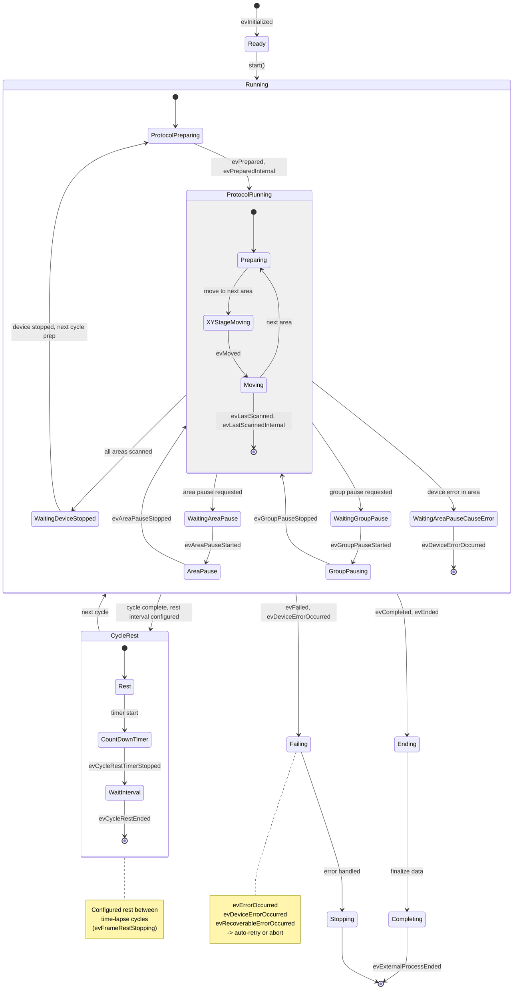
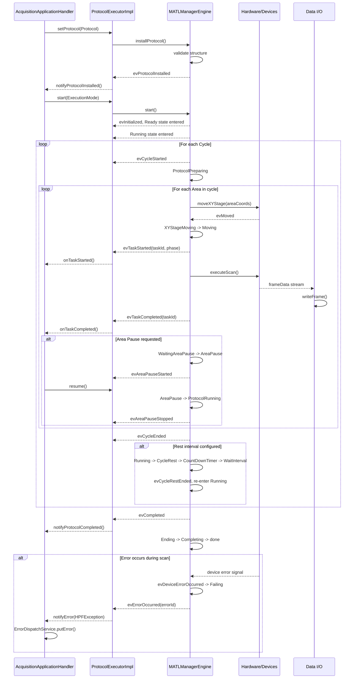
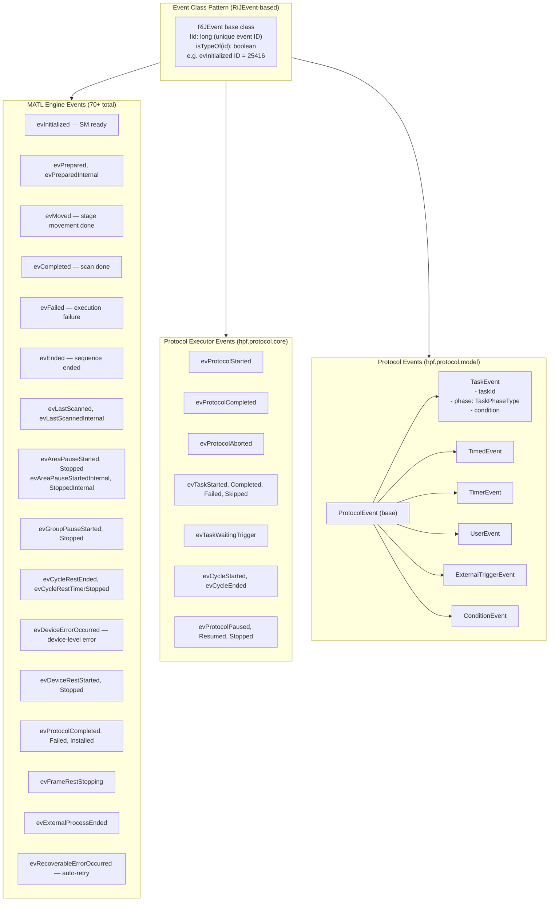

# Protocol Execution Engine Diagrams

## MATL (Multi-Area Time-Lapse) State Machine — MATLManagerEngine.java

## Protocol Execution Event Flow

## General Protocol Event Taxonomy

## FluoView Sequence Protocol Structure

```mermaid
graph TD
    subgraph SeqProto["Sequence Protocol\njp.co.olympus.fluoview.protocol.sequence"]
        SM["SequenceManagerImpl\nOrchestrates acquisition sequences"]

        subgraph Subtasks["Sub-Task Factories"]
            ST1["LoadParametersSubTaskFactory\nLoads observation params per step"]
            ST2["PrepareParametersSubTask\nPrepares device parameters"]
        end

        subgraph Extenders["Sequence Manager Extenders"]
            EX1["ChannelSequenceManagerExtender\nHandles channel-specific sequencing"]
            EX2["ExperimentInfoSequenceManagerExtender\nAttaches experiment metadata"]
            EX3["OpticalElement, DiskSpaceCheck\nand other extenders"]
        end

        subgraph Commands["Protocol Commands"]
            CMD1["OpticalElementChangeCommand\nSwitches objectives/filters between steps"]
            CMD2["DiskSpaceCheckCommand\nValidates storage before start"]
            CMD3["Acquisition step commands"]
        end
    end

    HPFProto["hpf.protocol.core\nProtocolExecutorImpl"]

    SM -->|"creates"| ST1
    SM -->|"creates"| ST2
    SM -->|"uses"| EX1
    SM -->|"uses"| EX2
    SM -->|"uses"| EX3
    SM -->|"generates"| CMD1
    SM -->|"generates"| CMD2
    SM -->|"generates"| CMD3
    SM -->|"delegates execution to"| HPFProto
```

