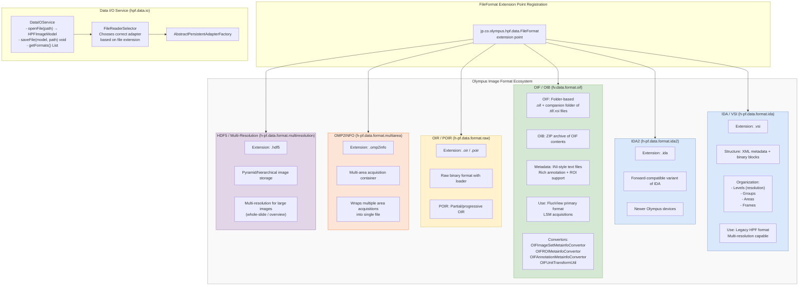
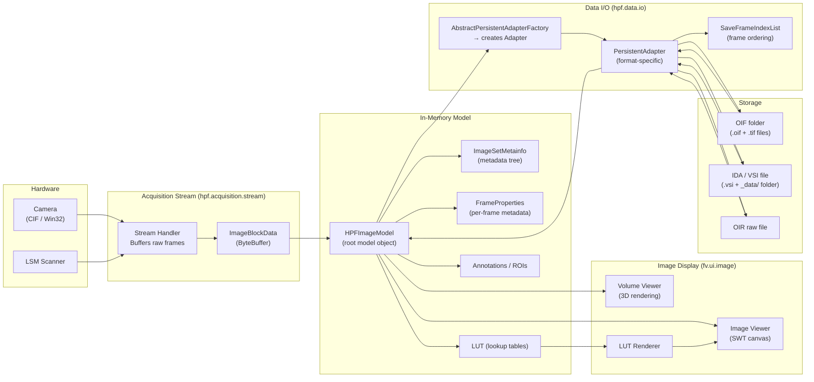

# Image Data Format Hierarchy & I/O Pipeline

## Format Registration & Factory Hierarchy

```mermaid
classDiagram

    class AbstractPersistentAdapterFactory {
        <<interface>>
        +getExtension() String
        +createAdapter(HPFImageModel) PersistentAdapter
    }

    class AbstractSaveFrameIndexListFactory {
        <<interface>>
        +createFactory() SaveFrameIndexList
    }

    class InfomationUtil {
        <<interface>>
        +getFormatInfo() FormatInfo
    }

    %% H-PF format factories
    class IdaPersistentAdapterFactory {
        +getExtension() ".vsi"
        +createAdapter() IdaPersistentAdapter
    }
    class Ida2PersistentAdapterFactory {
        +getExtension() ".ida"
        +createAdapter() Ida2PersistentAdapter
    }
    class RawPersistentAdapterFactory {
        +getExtension() ".oir"
        +createAdapter() RawPersistentAdapter
    }
    class PoirPersistentAdapterFactory {
        +getExtension() ".poir"
        +createAdapter() PoirPersistentAdapter
    }
    class Omp2infoPersistentAdapterFactory {
        +getExtension() ".omp2info"
        +createAdapter() Omp2infoPersistentAdapter
    }
    class MultiResolutionPersistentAdapterFactory {
        +getExtension() ".hdf5"
        +createAdapter() MultiResolutionPersistentAdapter
    }

    %% FluoView format factories
    class OIFPersistentAdapterFactory {
        +getExtension() ".oif"
        +createAdapter() OIFPersistentAdapter
    }
    class OIBPersistentAdapterFactory {
        +getExtension() ".oib"
        +createAdapter() OIBPersistentAdapter
    }

    AbstractPersistentAdapterFactory <|.. IdaPersistentAdapterFactory
    AbstractPersistentAdapterFactory <|.. Ida2PersistentAdapterFactory
    AbstractPersistentAdapterFactory <|.. RawPersistentAdapterFactory
    AbstractPersistentAdapterFactory <|.. PoirPersistentAdapterFactory
    AbstractPersistentAdapterFactory <|.. Omp2infoPersistentAdapterFactory
    AbstractPersistentAdapterFactory <|.. MultiResolutionPersistentAdapterFactory
    AbstractPersistentAdapterFactory <|.. OIFPersistentAdapterFactory
    AbstractPersistentAdapterFactory <|.. OIBPersistentAdapterFactory

    %% Adapters
    class HPFObjectAdapterImpl {
        <<abstract>>
        +read(HPFImageModel) void
        +write(HPFImageModel) void
        +dispose() void
    }

    class MultipleImagePersistentAdapter {
        <<interface>>
        +readFrame(frameIndex) ImageBlockData
        +writeFrame(frameIndex, ImageBlockData) void
        +getFrameCount() int
    }

    class IdaPersistentAdapter {
        -IdaHandles ida
        -IdaReader reader
        -IdaHPFImageAdapter hPFImageAdapter
        -CommonHPFImagePropertiesAdapter propertiesAdapter
        -IdaLutAdapter lutAdapter
        -IdaFramePropertiesAdapter framePropertiesAdapter
        -IdaImageBodyAdapter imageBodyAdapter
        -CommonAnnotationAdapter annotationAdapter
        -CommonOverlayItemAdapter overlayItemAdapter
        -CommonReferenceImageAdapter referenceImageAdapter
        -IdaThumbnailImageAdapter thumbnailImageAdapter
        -IdaFragmentAdapter fragmentAdapter
        -CommonEventListAdapter eventListAdapter
    }

    class OIFPersistentAdapter {
        -OIFImageSetMetainfo metainfo
        +read() void
        +write() void
    }

    HPFObjectAdapterImpl ..|> MultipleImagePersistentAdapter
    IdaPersistentAdapter --|> HPFObjectAdapterImpl
    OIFPersistentAdapter --|> HPFObjectAdapterImpl

    class ImageSetMetainfo {
        <<abstract>>
        +encode() byte[]
        +decode(byte[]) void
        +getMajorVersion() int
        +getMinorVersion() int
    }

    class OIFImageSetMetainfo {
        +IFileInformationHolder
        +ILutSet
        +IImagePropertyHolder
        +IAnnotatable
        +IOverlayItemListHolder
        +IReferenceImageInfoHolder
        +IEventListHolder
    }

    ImageSetMetainfo <|-- OIFImageSetMetainfo

    class ImageBlockData {
        -ByteBuffer buffer
        +getData() ByteBuffer
        +getSize() int
    }

    IdaPersistentAdapter ..> ImageBlockData : reads/writes frames
    OIFPersistentAdapter ..> OIFImageSetMetainfo : uses
```

## Image Format Comparison

```mermaid
graph TD
    subgraph FormatOverview["Olympus Image Format Ecosystem"]

        subgraph IDA["IDA / VSI (h-pf.data.format.ida)"]
            IDA1["Extension: .vsi"]
            IDA2["Structure: XML metadata + binary blocks"]
            IDA3["Organization:\n- Levels (resolution)\n- Groups\n- Areas\n- Frames"]
            IDA4["Use: Legacy HPF format\nMulti-resolution capable"]
        end

        subgraph IDA2F["IDA2 (h-pf.data.format.ida2)"]
            I2A1["Extension: .ida"]
            I2A2["Forward-compatible variant of IDA"]
            I2A3["Newer Olympus devices"]
        end

        subgraph OIF["OIF / OIB (fv.data.format.oif)"]
            OIF1["OIF: Folder-based\n.oif + companion folder of .tif/.roi files"]
            OIF2["OIB: ZIP archive of OIF contents"]
            OIF3["Metadata: INI-style text files\nRich annotation + ROI support"]
            OIF4["Use: FluoView primary format\nLSM acquisitions"]
            OIF5["Convertors:\nOIFImageSetMetainfoConvertor\nOIFROIMetainfoConvertor\nOIFAnnotationMetainfoConvertor\nOIFUnitTransformUtil"]
        end

        subgraph OIR["OIR / POIR (h-pf.data.format.raw)"]
            OIR1["Extension: .oir / .poir"]
            OIR2["Raw binary format with loader"]
            OIR3["POIR: Partial/progressive OIR"]
        end

        subgraph OMP2["OMP2INFO (h-pf.data.format.multiarea)"]
            OMP1["Extension: .omp2info"]
            OMP2A["Multi-area acquisition container"]
            OMP2B["Wraps multiple area acquisitions\ninto single file"]
        end

        subgraph HDF5["HDF5 / Multi-Resolution (h-pf.data.format.multiresolution)"]
            HDF1["Extension: .hdf5"]
            HDF2["Pyramid/hierarchical image storage"]
            HDF3["Multi-resolution for large images\n(whole-slide / overview)"]
        end
    end

    subgraph FileFormatExt["FileFormat Extension Point Registration"]
        FF["jp.co.olympus.hpf.data.FileFormat\nextension point"]
        FF --> IDA & IDA2F & OIF & OIR & OMP2 & HDF5
    end

    subgraph DataIO["Data I/O Service (hpf.data.io)"]
        DIO["DataIOService\n- openFile(path) → HPFImageModel\n- saveFile(model, path) void\n- getFormats() List<FormatInfo>"]
        DIO --> FSel["FileReaderSelector\nChooses correct adapter\nbased on file extension"]
        FSel --> AbstractPersistentAdapterFactory
    end

    style FormatOverview fill:#f9f9f9,stroke:#999
    style IDA fill:#dae8fc,stroke:#6c8ebf
    style IDA2F fill:#dae8fc,stroke:#6c8ebf
    style OIF fill:#d5e8d4,stroke:#82b366
    style OIR fill:#fff2cc,stroke:#d6b656
    style OMP2 fill:#fce4d6,stroke:#ed7d31
    style HDF5 fill:#e1d5e7,stroke:#9673a6
```

## Image Data Flow: Acquisition → Disk → Display

```mermaid
flowchart LR
    subgraph HW["Hardware"]
        CAM["Camera\n(CIF / Win32)"]
        LSM["LSM Scanner"]
    end

    subgraph Stream["Acquisition Stream (hpf.acquisition.stream)"]
        ST["Stream Handler\nBuffers raw frames"]
        IB["ImageBlockData\n(ByteBuffer)"]
    end

    subgraph Model["In-Memory Model"]
        HIM["HPFImageModel\n(root model object)"]
        ISM["ImageSetMetainfo\n(metadata tree)"]
        FP["FrameProperties\n(per-frame metadata)"]
        LUT["LUT (lookup tables)"]
        ANN["Annotations / ROIs"]
    end

    subgraph IO["Data I/O (hpf.data.io)"]
        ADF["AbstractPersistentAdapterFactory\n→ creates Adapter"]
        ADP["PersistentAdapter\n(format-specific)"]
        IDX["SaveFrameIndexList\n(frame ordering)"]
    end

    subgraph Disk["Storage"]
        OIF2["OIF folder\n(.oif + .tif files)"]
        VSIF["IDA / VSI file\n(.vsi + _data/ folder)"]
        OIRF["OIR raw file"]
    end

    subgraph Display["Image Display (fv.ui.image)"]
        IV["Image Viewer\n(SWT canvas)"]
        VV["Volume Viewer\n(3D rendering)"]
        LUT2["LUT Renderer"]
    end

    CAM & LSM --> ST --> IB
    IB --> HIM
    HIM --> ISM & FP & LUT & ANN

    HIM --> ADF --> ADP
    ADP --> IDX
    ADP --> OIF2 & VSIF & OIRF

    OIF2 & VSIF & OIRF --> ADP
    ADP --> HIM
    HIM --> IV & VV
    LUT --> LUT2 --> IV
```
