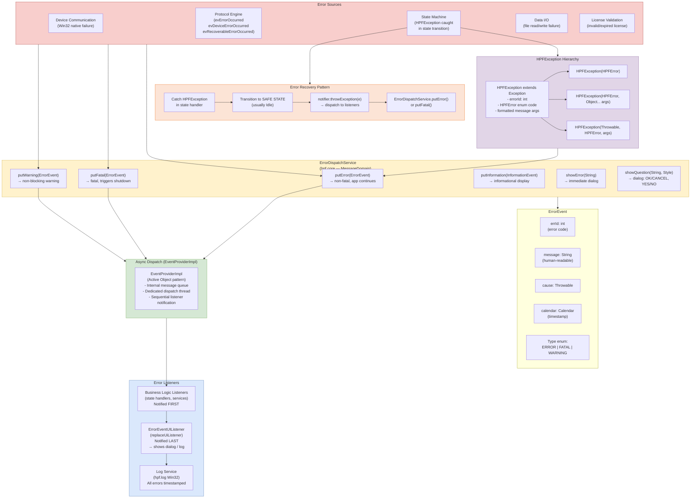
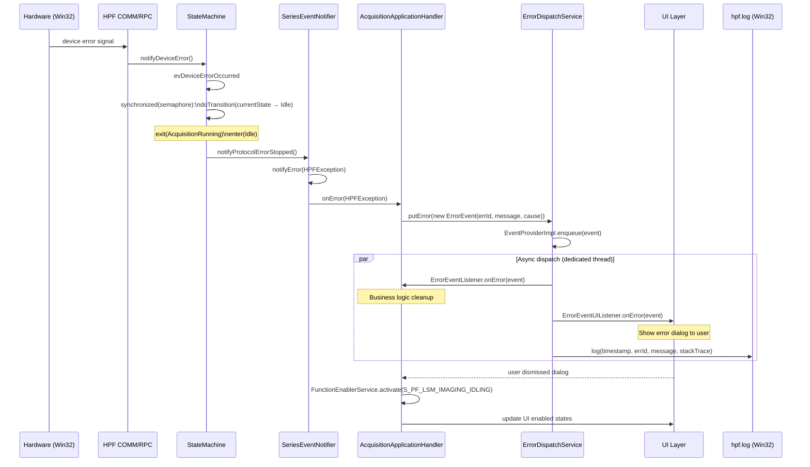
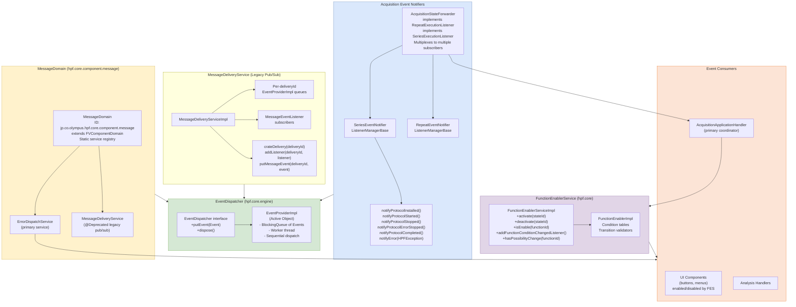
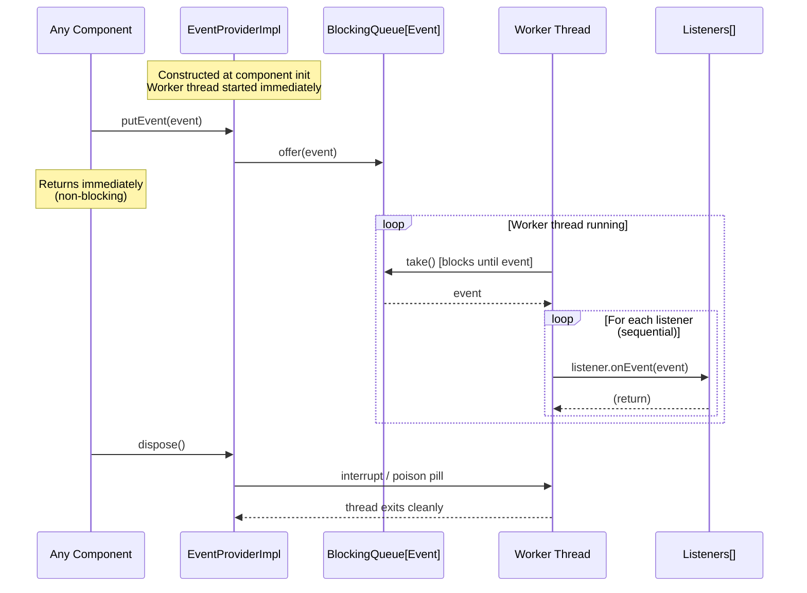

# Error Handling & Inter-Component Messaging

## Error Dispatch Architecture

## Error Flow Sequence: Device Error During Acquisition

## Inter-Component Messaging Architecture

## Active Object Pattern (EventProviderImpl) — Thread Safety Detail

