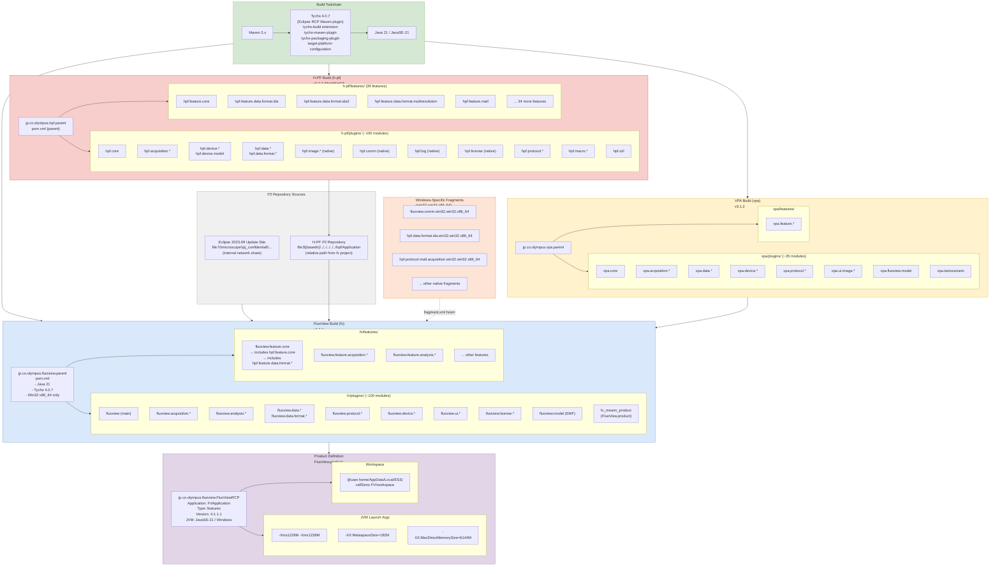
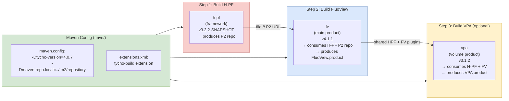
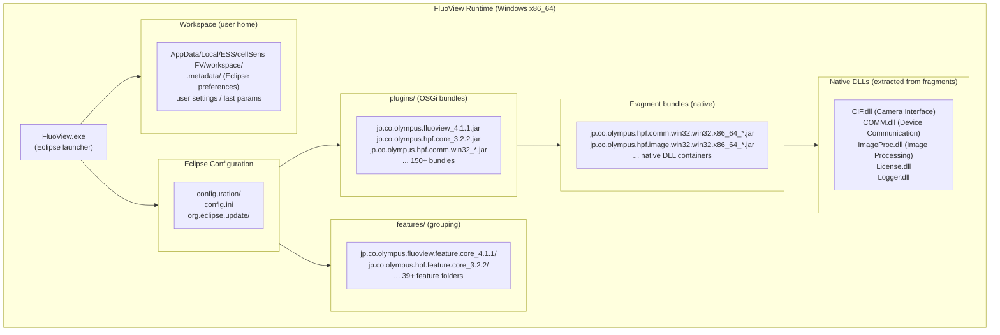

# Build & Deployment Structure

## Maven / Tycho Build Architecture

```mermaid
graph TD
    subgraph BuildToolchain["Build Toolchain"]
        MVN["Maven 3.x"]
        TYCHO["Tycho 4.0.7\n(Eclipse RCP Maven plugin)\ntycho-build extension\ntycho-maven-plugin\ntycho-packaging-plugin\ntarget-platform-configuration"]
        JAVA["Java 21 / JavaSE-21"]
        MVN --> TYCHO --> JAVA
    end

    subgraph Repos["P2 Repository Sources"]
        ECLIPSE["Eclipse 2023-09 Update Site\nfile:\\\\microscope\\pj_confidential\\...\n(internal network share)"]
        HPF_REPO["H-PF P2 Repository\nfile:${basedir}/../../../../../hpf/Application\n(relative path from fv project)"]
    end

    subgraph HPFBuild["H-PF Build (h-pf)\nv3.2.2-SNAPSHOT"]
        HPF_PARENT["jp.co.olympus.hpf.parent\npom.xml (parent)"]

        subgraph HPFPlugins["h-pf/plugins/ (~100 modules)"]
            HPF_P1["hpf.core"]
            HPF_P2["hpf.acquisition.*"]
            HPF_P3["hpf.device.*\nhpf.device.model"]
            HPF_P4["hpf.data.*\nhpf.data.format.*"]
            HPF_P5["hpf.image.* (native)"]
            HPF_P6["hpf.comm (native)"]
            HPF_P7["hpf.log (native)"]
            HPF_P8["hpf.license (native)"]
            HPF_P9["hpf.protocol.*"]
            HPF_P10["hpf.macro.*"]
            HPF_P11["hpf.util"]
        end

        subgraph HPFFeatures["h-pf/features/ (39 features)"]
            HPF_F1["hpf.feature.core"]
            HPF_F2["hpf.feature.data.format.ida"]
            HPF_F3["hpf.feature.data.format.ida2"]
            HPF_F4["hpf.feature.data.format.multiresolution"]
            HPF_F5["hpf.feature.matl"]
            HPF_F6["... 34 more features"]
        end

        HPF_PARENT --> HPFPlugins & HPFFeatures
    end

    subgraph FVBuild["FluoView Build (fv)\nv4.1.1"]
        FV_PARENT["jp.co.olympus.fluoview.parent\npom.xml\n- Java 21\n- Tycho 4.0.7\n- Win32 x86_64 only"]

        subgraph FVPlugins["fv/plugins/ (~100 modules)"]
            FV_P1["fluoview (main)"]
            FV_P2["fluoview.acquisition.*"]
            FV_P3["fluoview.analysis.*"]
            FV_P4["fluoview.data.*\nfluoview.data.format.*"]
            FV_P5["fluoview.protocol.*"]
            FV_P6["fluoview.device.*"]
            FV_P7["fluoview.ui.*"]
            FV_P8["fluoview.license.*"]
            FV_P9["fluoview.model (EMF)"]
            FV_P10["fv_meavn_product\n(FluoView.product)"]
        end

        subgraph FVFeatures["fv/features/"]
            FV_F1["fluoview.feature.core\n→ includes hpf.feature.core\n→ includes hpf.feature.data.format.*"]
            FV_F2["fluoview.feature.acquisition.*"]
            FV_F3["fluoview.feature.analysis.*"]
            FV_F4["... other features"]
        end

        FV_PARENT --> FVPlugins & FVFeatures
    end

    subgraph VPABuild["VPA Build (vpa)\nv3.1.2"]
        VPA_PARENT["jp.co.olympus.vpa.parent"]

        subgraph VPAPlugins["vpa/plugins/ (~35 modules)"]
            VPA_P1["vpa.core"]
            VPA_P2["vpa.acquisition.*"]
            VPA_P3["vpa.data.*"]
            VPA_P4["vpa.device.*"]
            VPA_P5["vpa.protocol.*"]
            VPA_P6["vpa.ui.image.*"]
            VPA_P7["vpa.fluoview.model"]
            VPA_P8["vpa.testscenario"]
        end

        subgraph VPAFeatures["vpa/features/"]
            VPA_F1["vpa.feature.*"]
        end

        VPA_PARENT --> VPAPlugins & VPAFeatures
    end

    subgraph Product["Product Definition\nFluoView.product"]
        PROD["jp.co.olympus.fluoview.FluoViewRCP\nApplication: FVApplication\nType: features\nVersion: 4.1.1.1\nJVM: JavaSE-21 / Windows"]

        subgraph JVMArgs["JVM Launch Args"]
            JA1["-Xms1228M -Xmx1228M"]
            JA2["-XX:MetaspaceSize=192M"]
            JA3["-XX:MaxDirectMemorySize=6144M"]
        end

        subgraph WorkspaceArg["Workspace"]
            WS["@user.home/AppData/Local/ESS/\ncellSens FV/workspace"]
        end

        PROD --> JVMArgs & WorkspaceArg
    end

    subgraph WinFragments["Windows-Specific Fragments\n(win32.win32.x86_64)"]
        WF1["fluoview.comm.win32.win32.x86_64"]
        WF2["hpf.data.format.ida.win32.win32.x86_64"]
        WF3["hpf.protocol.matl.acquisition.win32.win32.x86_64"]
        WF4["... other native fragments"]
    end

    BuildToolchain --> FVBuild & HPFBuild & VPABuild
    Repos --> FVBuild
    HPFBuild --> HPF_REPO
    HPF_REPO --> FVBuild
    FVBuild --> Product
    WinFragments -.->|"fragment.xml host="| FVBuild
    VPABuild --> FVBuild

    style BuildToolchain fill:#d5e8d4,stroke:#82b366
    style HPFBuild fill:#f8cecc,stroke:#b85450
    style FVBuild fill:#dae8fc,stroke:#6c8ebf
    style VPABuild fill:#fff2cc,stroke:#d6b656
    style Product fill:#e1d5e7,stroke:#9673a6
    style WinFragments fill:#fce4d6,stroke:#ed7d31
    style Repos fill:#f0f0f0,stroke:#999
```

## Project Dependency Chain & Build Order

```mermaid
flowchart LR
    subgraph Step1["Step 1: Build H-PF"]
        HP["h-pf\n(framework)\nv3.2.2-SNAPSHOT\n→ produces P2 repo"]
    end

    subgraph Step2["Step 2: Build FluoView"]
        FV2["fv\n(main product)\nv4.1.1\n→ consumes H-PF P2 repo\n→ produces FluoView.product"]
    end

    subgraph Step3["Step 3: Build VPA (optional)"]
        VP["vpa\n(volume product)\nv3.1.2\n→ consumes H-PF + FV\n→ produces VPA product"]
    end

    subgraph Maven["Maven Config (.mvn/)"]
        MC["maven.config:\n-Dtycho-version=4.0.7\n-Dmaven.repo.local=../.m2/repository"]
        ME["extensions.xml:\ntycho-build extension"]
    end

    HP -->|"file:// P2 URL"| FV2
    FV2 -->|"shared HPF + FV plugins"| VP
    Maven --> Step1 & Step2 & Step3

    style Step1 fill:#f8cecc,stroke:#b85450
    style Step2 fill:#dae8fc,stroke:#6c8ebf
    style Step3 fill:#fff2cc,stroke:#d6b656
    style Maven fill:#d5e8d4,stroke:#82b366
```

## Runtime Deployment Layout (Windows)

```mermaid
graph TD
    subgraph Runtime["FluoView Runtime (Windows x86_64)"]
        EXE["FluoView.exe\n(Eclipse launcher)"]

        subgraph ECF["Eclipse Configuration"]
            CONFIG["configuration/\nconfig.ini\norg.eclipse.update/"]
        end

        subgraph Plugins["plugins/ (OSGi bundles)"]
            PL["jp.co.olympus.fluoview_4.1.1.jar\njp.co.olympus.hpf.core_3.2.2.jar\njp.co.olympus.hpf.comm.win32_*.jar\n... 150+ bundles"]
        end

        subgraph Frags["Fragment bundles (native)"]
            FR["jp.co.olympus.hpf.comm.win32.win32.x86_64_*.jar\njp.co.olympus.hpf.image.win32.win32.x86_64_*.jar\n... native DLL containers"]
        end

        subgraph Native["Native DLLs (extracted from fragments)"]
            DLL["CIF.dll (Camera Interface)\nCOMM.dll (Device Communication)\nImageProc.dll (Image Processing)\nLicense.dll\nLogger.dll"]
        end

        subgraph Features["features/ (grouping)"]
            FEAT["jp.co.olympus.fluoview.feature.core_4.1.1/\njp.co.olympus.hpf.feature.core_3.2.2/\n... 39+ feature folders"]
        end

        subgraph WS["Workspace (user home)"]
            WSDIR["AppData/Local/ESS/cellSens FV/workspace/\n.metadata/ (Eclipse preferences)\nuser settings / last params"]
        end
    end

    EXE --> ECF
    ECF --> Plugins
    Plugins --> Frags --> Native
    ECF --> Features
    EXE --> WS
```
