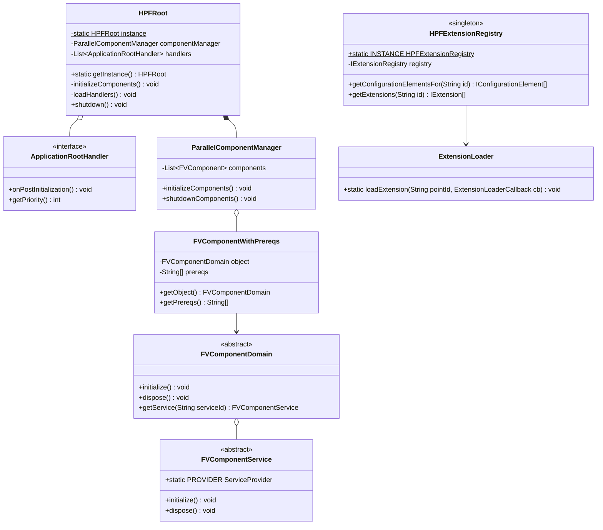
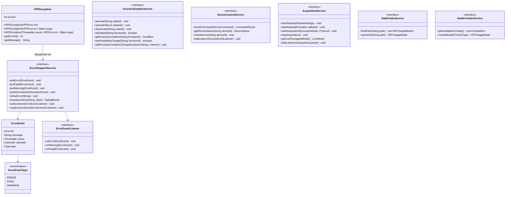
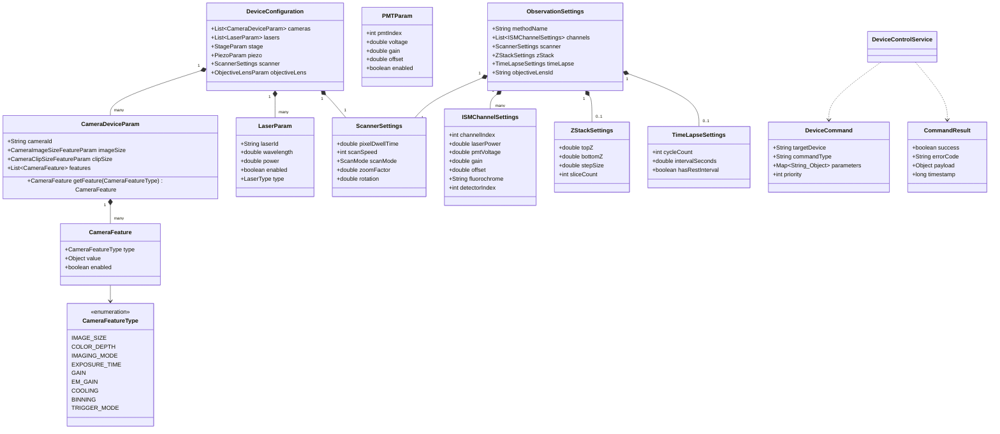
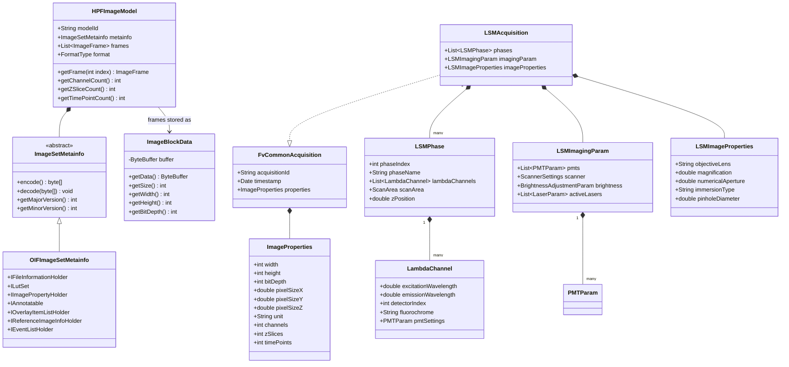
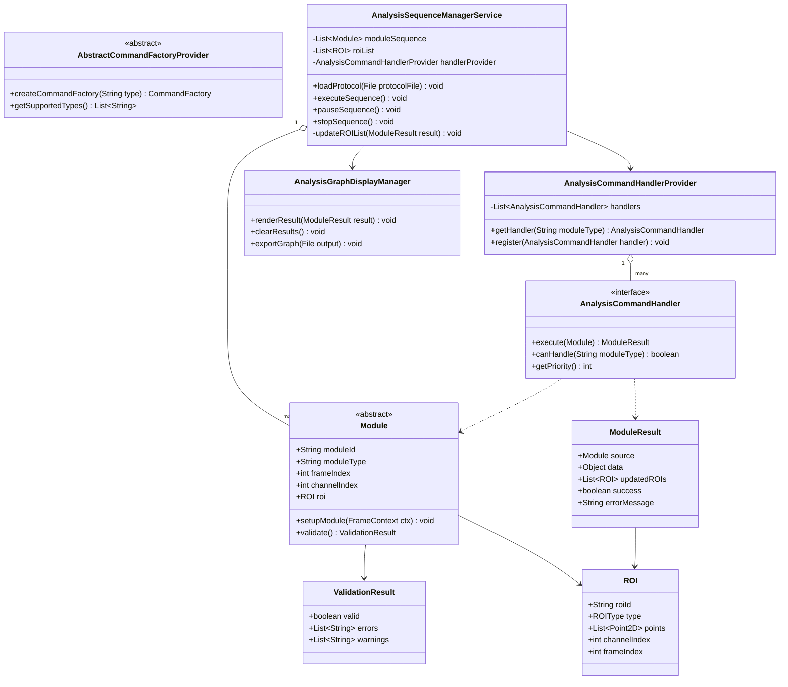
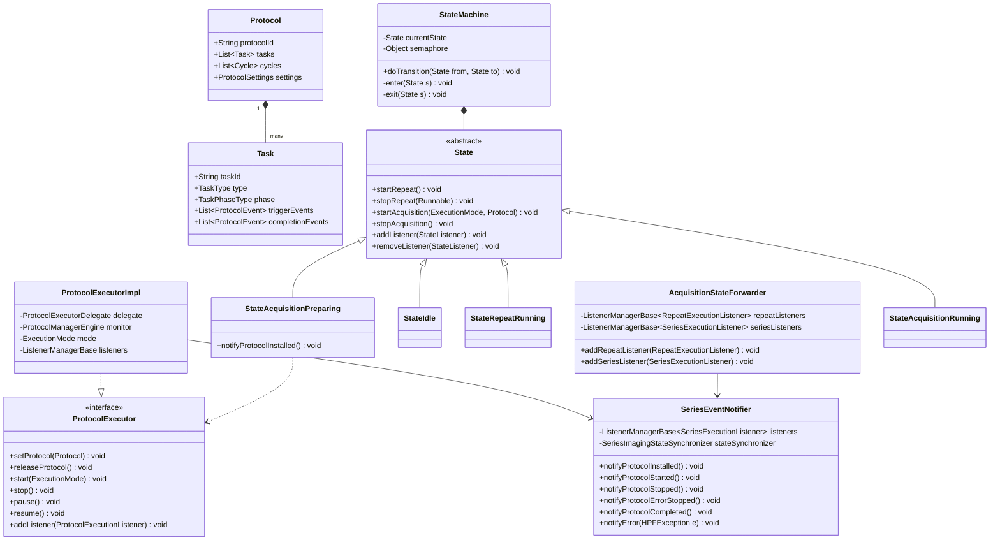

# Expanded Class Diagram — Full Domain Model

## Bootstrap & Component Framework

## Service Layer

## Device & Acquisition Models

## Image Model (EMF/ECORE)

## Analysis Framework

## Protocol Engine

